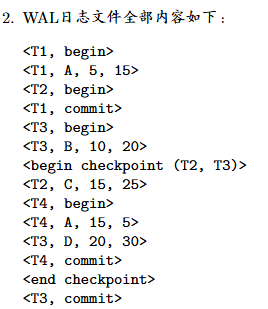

# 2025春数据库系统-cyk
## 笔者成绩

教学班排名：10
## 学习方法
- 听[B站网课](https://www.bilibili.com/video/BV1ii4y1S7Uk/?spm_id_from=333.337.search-card.all.click&vd_source=de2c6ec66aad0a525c6026af990f34a3)，做作业
- 做课件的关系代数和SQL练习，答案在[这里](./课件/数据库系统-zzn老师课件SQL查询参考答案.txt)
- 简单写一下往年题
## 一些说明
笔者感觉试题很简单，感觉基本没有拿不定的，不过看起来考的并不理想，不太清楚为什么扣分，学弟学妹参考笔者资料的时候可以谨慎一点。另外作业答案并非官方，标准答案并未公布。
实验内容不难，跟上一届不一样，改编的人大`RUCBASE`，问一问GPT老师再追根溯源一下就可以完成了。验收方面，笔者的老师是zzn老师，两个助教都是有备而来，拷打比较严格，看代码的时候尤其要注意各种数据结构，比如`LRUReplacer`中的`lrulist_`和`lruhash_`，以及`SmManager`中的`fhs_`和`ihs_`等等。
## 试题回忆
### 选择（一共10个，能回忆起7个）
#### 1. 属性(a, b)可以唯一标识关系R中的每一个元组，但是a不能，则：
A. (a, b)是R的超键
B. a是R的超键
C. b是R的超键
D. 以上说法均不对
*说明：这个题笔者没多想，选的A，但是笔者的同学说*
*笔者觉得很有道理，但是难以确定*
#### 2. 线性哈希索引现有n=6个桶，桶号0,1,2,3,4,5，现增加一个桶，问哪个桶中的索引项需要重新分配
m = 4, 现在多了6号桶, 6 mod m = 2, 说明原来mod 2m算下来等于6的索引项由于没有6号桶所以会被放在2号桶中，现在有了6号桶那么2号桶中的这部分索引项就要滚出来了。
#### 3. 查询处理的过程不包含(A)
A. 查询生成 B. 查询优化 C. 查询执行 D. SQL解析
#### 4. 关系中任意元组在主键中的属性值非空，这是(A)
A. 实体完整性约束 B. 参照完整性约束 C. 用户定义完整性约束 D. *凑数的*
#### 5. `外存归并排序算法`（也可能是`基于排序的去重算法`）若要处理B(R)页的关系，对缓冲池可用页数M的要求为
$M \geq \sqrt{B(R)}$
#### 6. `DBMS`崩溃导致已提交的事务只有一部分操作被同步到磁盘，这违反了事务的什么特性(A)
A. 原子性 B. 一致性 C. 隔离性 D. 持久性 
#### 7. 给一个关系加了IX锁，则还允许加下列哪种锁
A. IS 
B. S 
C. SIX 
D. X
#### 8. 还有一个哪一个不属于系统故障的，选项忘记了

### 证明
#### 1. 已知关系 $ R(\underline{a}, b) $ 和 $ S(\underline{a}, b) $ ，证明 $\pi_{R.a, R.b}(\sigma_{S.a = \text{null}}(R \ \text{\textbf{⟕}} \ S)) = R - S $
#### 2. 非常类似这道作业题

### 简答
#### 1. 用SQL语言写出下列操作
已知：
- 发射(飞船名称, 发射时间)
- 乘组(飞船名称, 姓名)
- 航天员(姓名, 性别, 年龄)

i. 查询那些无人发射任务的飞船名称及发射时间，并按发射时间升序排序
```SQL
SELECT 飞船名称，发射时间 
FROM 发射 NATURAL JOIN 乘组 
WHERE 姓名 IS NULL 
ORDER BY 发射时间 ASC；
```
ii. 查询至少执行过两次航天任务的女性航天员的姓名
```SQL
SELECT 姓名 
FROM 乘组 NATURAL JOIN 航天员 
WHERE 性别 = '女' 
GROUP BY 姓名 
HAVING COUNT(飞船名称) >= 2;
```

#### 2. 缓冲池的页表（数据是编的）
缓冲池的页框中存放的页面信息如下表：
|页号|页框号|
|-|-|
|文件1页2|1|
|文件2页3|2|
|文件1页5|3|
|文件3页4|4|

缓冲池起始地址$L$，页面大小$B$
各个槽的`dirty`，`pin_count`和最后访问时间（下标越大越晚）信息如下表：
|页框号|dirty|pin_count|最后访问时间|
|-|-|-|-|
|1|0|1|$t_2$|
|2|1|0|$t_1$|
|3|1|1|$t_3$|
|4|0|0|$t_4$|

- i. 写出此时的页表
- ii. 缓冲池采用`LRU`算法，如果这时请求文件2页4中槽号为3的元组，写出DBMS所作的事情

#### 3. B+树
除根节点外，每个内节点最多四个儿子节点，最少两个儿子节点，插入0200
*省略了插入后不变的节点*

答案：


#### 4. 查询优化
已知
```
- R(a,b) T(R) = 1000 V(R,a) = 20  V(R,b) = 100
- S(b,c) T(S) = 1000 V(S,b) = 500 V(S,c) = 20
- T(c,d) T(T) = 1000 V(T,c) = 50  V(T,d) = 100
```
求代价最小的左深连接树
#### 5. SS2PL
类似作业这道题


第二问问的是采用`wound-wait死锁预防策略`，并且$T_i$中$i$越小，优先级越大
#### 6. 故障恢复

类似作业，给一个日志，说明采用`Steal+No-force`策略
- i. 正常执行时，检查点中间会做什么
- ii. 发生故障，恢复后应该做什么

### 设计
已知：
- 演出信息：演出名称，演出时间，演出地点，票务信息（座位号，状态，...），参演人员 *注：同一演出同一时间只有一场*
- 表演者信息：名称（个人或团体名称），简介，参与的演出名称、地点
- 评论信息：评论内容，评论时间，评论的演出名称、地点

问：
- i. 画E-R图
- ii. 转换为关系数据库模式
- iii. 要频繁根据演出日期查询演出场次，请给出优化
