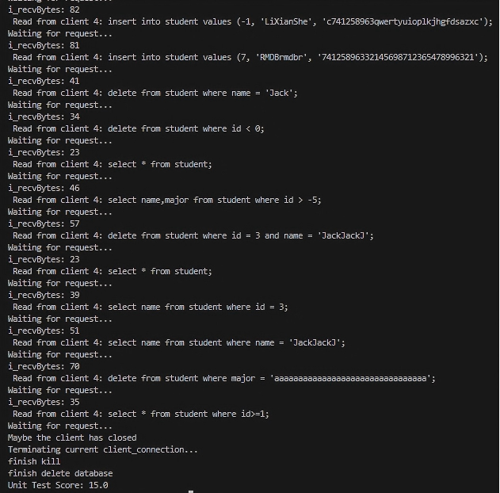

<!-- @import "style.css" -->

# 22CS22013《数据库系统》实验报告

姓名：曹熠坤

学号：2022110790

班级：22R0311 

专业：计算机科学与技术

日期：2025.6.7

## 声明

本人承诺该实验全部由本人独立完成，没有抄袭他人代码。若被证实本人存在抄袭现象或为他人抄袭提供帮助，本人愿意承担全部责任（包括但不限于扣分、取消考试资格、上报学部等）。

## 目录

[TOC]

## 实验1：缓冲区管理器实现

### 任务1：缓冲池页面替换策略实现

按照实验指导手册，介绍每项具体任务的实验过程、实验结果和实验分析。

#### （1）代码分析

##### `LRUReplacer`类
- 核心作用：用于实现缓冲池页框的`LRU`替换策略
- 成员变量及作用
  - `latch_ : std::mutex` 互斥锁，用于避免死锁发生
  - `LRUlist_ : std::list<frame_id_t>` 最近使用的页框链表，其头为最近使用的页框
    - `LRUhash_ : std::unordered_map<frame_id_t, std::list<frame_id_t>::iterator>` 用页框号查找页框在`LRUlist_`中的位置
  - `max_size_ : size_t` 缓冲池能容纳的页框数目
- 接口
  - `LRUReplacer` 构造函数，初始化其成员变量
  - `~LRUReplacer` 析构函数
  - `victim` 使用`LRU`策略删除一个牺牲页框，并返回页框号
  - `pin` 固定指定的页框，即该页面无法被淘汰
  - `unpin` 取消固定一个页框，代表该页面可以被淘汰
  - `Size` 获取缓冲池能容纳的页框数目
- 回答问题
  - `LRUlist_`的作用是什么：按时间顺序存储页框，根据`LRU`策略淘汰时只需淘汰其尾部的页面
  - `LRUhash_`的作用是什么：记录页框号->页框在`LRUlist_`中的位置的映射关系
  - `LRUlist_`和`LRUhash_`的关系是什么：`LRUhash_`用于快速定位`LRUlist_`中的元素位置，可以用于判断某页框是否在链表中，或增加/删除/修改链表中的页框
#### （2）`LRUReplacer::victim`函数的实现
##### 实现思路
- 如果`LRUlist_`为空，代表没有可用的页框，返回`false`
- 否则弹出位于`LRUlist_`尾部的页框，并从`LRUhash_`同步删除它，并将页框号赋给`frame_id`
#### （3）`LRUReplacer::pin`函数的实现
##### 实现思路
- 如果这个页框不在`LRUlist_`中，说明其不可能被淘汰，直接返回即可
- 否则从`LRUlist_`和`LRUhash_`删除该页框
#### （4）`LRUReplacer::unpin`函数的实现
##### 实现思路
- 如果`LRUlist_`未满，则将页框插入其头部
- 否则需要淘汰一个页框后在将这个页框插入链表头部
#### （5）测试结果

#### （6）实验结论
本任务成功实现了缓冲池的`LRU`策略，包括对页面的固定、取消固定和对最久未使用的页面的淘汰，通过这个任务我对缓冲池管理有了更深刻的认识。

### 任务2：缓冲池管理器实现

#### （1）代码分析
- `Page::is_dirty_`的作用是什么：表明该页框中的页在读入缓冲池后是否被改过
- `Page::pin_count_`的作用是什么：记录有多少个操作在使用这个页框，只有当`pin_count=0`时页框才可被换出去
- `BufferPoolManager::page_table_`的作用是什么：`pageID->frame_id`的映射，即记录页号为`pageID`的页存在缓冲区的哪个也框中
- `BufferPoolManager::free_list_`的作用是什么：存储空闲页框编号的链表
#### （2）`BufferPoolManager::find_victim_page`函数的实现
##### 实现思路
- 有空闲页框，则从`free_list_`中取出其头部的页框
- 无空闲帧，则用`LRU`策略淘汰`free_list_`的一个页框并将其编号赋给`frame_id`
#### （3）`BufferPoolManager::fetch_page`函数的实现
##### 实现思路
- 如果`page_id`在页表中，说明这个页在缓冲池中，将其固定
- 否则调用`find_victim_page`获得一个可用的页框
- 如果该页框是脏页，则将其写回磁盘
- 从磁盘中将目标页读到缓冲池的这个页框中
- 固定这个新页
#### （4）`BufferPoolManager::unpin_page`函数的实现
##### 实现思路
- 查找`page_id`，不在缓冲池中则返回`false`
- 将其`pin_count-1`
- 如果`pin_count`减到`0`，则调用`LRUReplacer::unpin`取消固定这个页
- 根据参数`is_dirty`修页框的脏位
#### （5）`BufferPoolManager::flush_page`函数的实现
##### 实现思路
- 查找`page_id`，不在缓冲池中则返回`false`
- 将页面写回磁盘
- 将页框的`is_dirty`位置为`false`
#### （6）`BufferPoolManager::new_page`函数的实现
##### 实现思路
- 获得一个可用的页框`victim_frame`，若无法获得则返回`nullptr`
- 在`fd`对应的文件分配一个新的`page_id`
- 若`victim_frame`是脏页，则将其数据写回磁盘
- 初始化新页面的元数据
- 返回获得的新页
#### （7）`BufferPoolManager::delete_page`函数的实现
##### 实现思路
- 在页表中中查找`page_id`，若不存在返回`true`
- 检查该页所在页框的`pin_count`是否为`0`，不为`0`则说明该页仍在使用，无法删除，返回`false`
- 将目标页数据写回磁盘
- 从页表中删除目标页，并重置其元数据
- 将其加入`free_list_`，返回true
#### （8）`BufferPoolManager::flush_all_pages`函数的实现
- 将缓冲池中的所有页写回到磁盘即可
#### （9）测试结果

#### （10）实验结论
本任务通过实现缓冲池管理器，实现了数据库中页面的固定与释放、脏页管理、LRU页面替换策略、页表与空闲页框管理等关键机制。


## 实验2：记录管理器实现

### 任务1：记录操作实现

#### （1）代码分析
##### a. `RmManager`类
- 核心作用： 对文件进行创建、删除、打开、关闭的操作。
- 成员变量及作用
  - `disk_manager_ : DiskManager*` 用于执行I/O操作，与磁盘文件进行交互
  - `buffer_pool_manager : BufferPoolManager*` 用于管理缓冲池
- 接口
  - `create_file` : 调用`DiskManager::create_file`方法创建新文件，并初始化文件的`RmFileHdr`
  - `destroy_file` : 调用`DiskManager::destroy_file`方法删除文件
  - `open_file` : 调用`DiskManager::open_file`方法打开文件，并创建该文件的`RmFileHandle` 
  - `close_file`: 将文件头写回磁盘，将缓冲池的所有页写回磁盘，最后关闭当前文件
##### b. `RmFileHandle`类
- 核心作用：管理一个表的数据文件
- 成员变量及作用
  -  `disk_manager_ : DiskManager*` 用于执行I/O操作，与磁盘文件进行交互
  -  `buffer_pool_manager_ : BufferPoolManager*` 用于管理缓冲池
  -  `fd_ : int` 打开文件后产生的文件句柄
  -  `file_hdr_ : RmFileHdr` 文件头，维护当前表文件的元数据
- 接口
  - 构造函数：初始化成员变量，从磁盘读取文件头，设置文件的下一个可分配的页号
  - `get_file_hdr`: 返回成员变量`file_hdr_`
  - `GetFd` : 返回成员变量`fd_`
  - 其余见（2）-（9）
##### c. `RmPageHandle`类
- 核心作用：管理文件中的一个页
- 成员变量及作用
    - `file_hdr : RmFileHdr` 当前页面所在文件的文件头指针
    - `page : Page*` 页面的实际数据，包括页面存储的数据、元信息等
    - `page_hdr : RmPageHdr*` page->data的第一部分，指向`page_hdr`的首地址，长度为`sizeof(RmPageHdr)`
    - `bitmap : char*` page->data的第二部分，指向`bitmap`的首地址，长度为`file_hdr->bitmap_size`
    - `slots : char*` page->data的第三部分，指向`slots`的首地址，每个`slot`的长度为`file_hdr->record_size`
- 接口
  - 构造函数：根据页面各组成部分的长度初始化上述三个指针
  - `get_slot`：根据槽号返回槽首地址

#### （2）`RmFileHandle::get_record`函数的实现

##### 实现思路
- 根据`rid(page_no, slot_no)`的`page_no`获取该页的`page_handle`
- 根据`rid`的`slot_no`获取该槽的首地址
- 在`file_hdr_`中读取槽大小`record_size`
- 创建新纪录
#### （3）`RmFileHandle::insert_record`函数的实现

##### 指定插入位置rid的版本
- 根据`rid(page_no, slot_no)`的`page_no`获取该页的`page_handle`
- 判断该位置是否已经有记录，有则不能插入
- 设置`bitmap`的对应位
- 将`buf`对应的数据（长度为`record_size`）memcpy到`rid`的`slot_no`对应的槽首地址
- 页的槽数加1
- 页的`dirty`位置1
- unpin该页（因为已经完成操作）

##### 未指定插入位置的版本
- 调用`create_page_handle`找到有空闲槽的页面，获取其`page_handle`
- 根据`page_handle`的`bitmap`查找第一个空槽，并检查返回值是否合法
- 同上拷贝数据到该槽
- 页的槽数加1
- 检查插入一个槽之后是否使页满，若满则：
  - 从`file_hdr`中的空闲页链表摘除该页
  - 将`file_hdr`写回磁盘
- 页的`dirty`位置1
- unpin该页（因为已经完成操作）
- 返回插入的记录的`rid`

#### （4）`RmFileHandle::delete_record`函数的实现

##### 实现思路
- 根据`rid(page_no, slot_no)`的`page_no`获取该页的`page_handle`
- 检查`bitmap`，若无此记录，则报错
- 清空`bitmap`的对应位
- 页的槽数减1
- 若删除一条记录后导致本来满的页变成未满，则调用`release_page_handle`进行处理
- 页的`dirty`位置1
- unpin该页（因为已经完成操作）

#### （5）`RmFileHandle::update_record`函数的实现

##### 实现思路
- 根据`rid(page_no, slot_no)`的`page_no`获取该页的`page_handle`
- 检查`bitmap`，若无此记录，则报错
- 将`buf`对应的数据（长度为`record_size`）memcpy到`rid`的`slot_no`对应的槽首地址
- 页的`dirty`位置1
- unpin该页（因为已经完成操作）

#### （6）`RmFileHandle::fetch_page_handle`函数的实现    

##### 实现思路
- 检查page_no是否合法
- 调用`BufferPoolManager::fetch_page`从缓冲池获取该页，并获得其页指针`page`，并检查其合法性
- 将`file_hdr_`和`page`打包成`RmPageHandle`实体返回

#### （7）`RmFileHandle::create_new_page_handle`函数的实现

##### 实现思路
- 使用当前文件的页数`num_pages`作为新页的`page_no`创建新页`page`
- 打包成`page_handle`
- 初始化该页的页头
- 更新文件的文件头并写回
- 返回`page_handle`

#### （8）`RmFileHandle::create_page_handle`函数的实现

##### 实现思路
- 若文件有空闲页，则根据该页的`page_no`获取该页的`page_handle`并返回
- 否则使用`create_new_page_handle`创建新页

#### （9）`RmFileHandle::release_page_handle`函数的实现

##### 实现思路
- 将该页插入文件的空闲页链表（头插）
- 由于更改了`file_hdr_`，需要将其写回

#### （10）测试结果

#### （11）实验结论
本任务通过对`RmFileHandle`类的实现，理解了数据库系统中记录管理模块的底层逻辑与数据操作流程，实现并验证了记录的插入、删除、更新、读取等核心功能。

### 任务2：记录迭代器实现
#### （1）代码分析
##### `RmScan`类
- 核心作用：对文件记录进行遍历
- 成员变量及作用
  - `file_handle_ : RmFileHandle*` 用于访问和操作当前扫描的表文件
  - `rid_ : Rid` 用于存储当前扫描到的位置的记录
- 接口
  - 构造函数：初始化两个成员变量，并调用`next`指向第一条非空记录位置
  - `next`: 移动到下一条非空记录
  - `is_end`: 判断是否到达文件末尾
#### （2）`RmScan::RmScan`构造函数的实现
##### 实现思路
- 初始化`file_handle_`
- 初始化`rid_`为`(-1, -1)`
- 调用`next`指向第一条非空记录位置
#### （3）`RmScan::next`函数的实现
##### 实现思路
流程图如下：
```
         开始
          ↓
    ————→[页号超出范围] ?   -否→  rid_ = (-1, -1) 未找到
    |      ↓是                 
    |    获取该页page_handle        
    |      ↓
    |    根据page_handle.bitmap找下一条记录的位置
    |      ↓
    |    [在当前页没找到] ?  -否→ 找到记录，返回
    |      ↓是                              
    ———— 找下一页    
```
#### （4）`RmScan::is_end`函数的实现
##### 实现思路：
只需要判断`rid_`是否为`(-1,-1)`即可
#### （5）测试结果
同任务1中的测试：


#### （6）实验结论
通过本任务，我更加深入地理解了记录文件的存储结构及基于位图的记录管理方式，掌握了`RmScan`类的迭代扫描逻辑，实现了对非空记录的顺序访问。

## 实验3：数据定义的实现

### 任务1：元数据管理实现

#### （1）代码分析
##### a. `ColMeta` 结构体

- 核心功能：用于描述字段的信息
- 成员变量及作用
  - `tab_name : std::string` 字段所属表名称
  - `name : std::string` 字段名称
  - `type : ColType` 字段类型
  - `len : int` 字段长度
  - `offset : int` 字段位于记录中的偏移量
  - `index : bool` 保留（暂未使用）
- 重载运算符
  - `<<`：将 `ColMeta` 对象写到输出流（如文件或标准输出）
  - `>>`：从输入流中读入一个 `ColMeta` 对象


##### b. `TabMeta` 结构体

- 核心功能：用于描述一个表的元数据信息，包括字段列表和索引信息
- 成员变量及作用
  - `name : std::string` 表名称
  - `cols : std::vector<ColMeta>` 表中字段信息的集合
  - `indexes : std::vector<IndexMeta>` 表上建立的索引集合
- 成员函数
  - `is_col(col_name)`：判断表中是否存在名为 `col_name` 的字段
  - `is_index(col_names)`：判断表中是否建立了以 `col_names` 为组合键的索引
  - `get_index_meta(col_names)`：获取匹配字段列表的索引元数据，若不存在则抛出异常
  - `get_col(col_name)`：根据字段名获取字段元数据，若不存在则抛出异常
- 重载运算符
  - `<<`：将 `TabMeta` 对象写到输出流（包括其所有字段和索引）
  - `>>`：从输入流中读入一个 `TabMeta` 对象（包括字段和索引信息）

##### c. `DbMeta` 类

- 核心功能：管理整个数据库的元数据，包括数据库名称和所有表的元数据
- 成员变量及作用
  - `name_ : std::string` 数据库名称
  - `tabs_ : std::map<std::string, TabMeta>` 数据库中所有表的映射（表名 → 表元数据）
- 成员函数
  - `is_table(tab_name)`：判断数据库中是否存在名为 `tab_name` 的表
  - `SetTabMeta(tab_name, meta)`：设置或更新表名为 `tab_name` 的元数据
  - `get_table(tab_name)`：获取指定表的元数据，若不存在则抛出异常
- 重载运算符
  - `<<`：将 `DbMeta` 写入输出流，包括数据库名称和所有表的元数据
  - `>>`：从输入流中读入 `DbMeta` 对象（包含所有表）

##### d. `SmManager`类
-  核心功能：系统管理器，负责数据库的创建、打开、关闭、删除等操作，同时管理表和索引的元数据与文件句柄，是数据库系统的顶层管理组件

- 成员变量及作用

  - `db_ : DbMeta`
  当前打开的数据库的元数据

  - `fhs_ : std::unordered_map<std::string, std::unique_ptr<RmFileHandle>>`
  表名 -> 表数据文件句柄的映射。用于管理当前数据库中每张表对应的记录文件

  - `ihs_ : std::unordered_map<std::string, std::unique_ptr<IxIndexHandle>>`
  索引文件名 -> 索引文件句柄的映射。用于管理当前数据库中每个索引的索引文件

  - `disk_manager_ : DiskManager*`
  底层磁盘管理器，用于处理物理页的分配、回收与持久化等操作

  - `buffer_pool_manager_ : BufferPoolManager*`
  缓冲池管理器，负责缓存页的调度、置换和缓存一致性

  - `rm_manager_ : RmManager*`
  记录管理器，用于操作记录层的数据，如表的记录插入、删除、读取等

  - `ix_manager_ : IxManager*`
  索引管理器，负责创建、删除、维护索引文件


- 构造函数与析构函数

  - `SmManager` 构造函数，初始化指针成员变量

  - `~SmManager` 析构函数，当前为空
- 接口

  - `get_bpm` 获取缓冲池管理器指针

  - `get_rm_manager` 获取记录管理器指针

  - `get_ix_manager` 获取索引管理器指针

  - `is_dir` 判断指定名称的数据库目录是否存在

  - `create_db` 创建一个新的数据库，包括创建目录与初始化数据库元数据文件

  - `drop_db` 删除指定名称的数据库（目录及相关文件）

  - `open_db` 打开一个已有的数据库，加载数据库元数据，并初始化表与索引的文件句柄

  - `close_db` 关闭当前数据库，释放所有句柄，并保存元数据

  - `flush_meta` 将当前数据库的元数据写回磁盘，持久化更新

  - `show_tables` 显示当前数据库中所有表的名称

  - `desc_table` 展示指定表的字段定义（字段名、类型、长度等）

  - `create_table` 创建一张新表，建立元数据并生成数据文件

  - `drop_table` 删除指定表及其对应的数据和索引文件，并更新元数据

  - `create_index` 在指定表的字段（组合键）上创建索引，并更新元数

  - `drop_index` 删除指定字段组合上的索引

  - `void drop_index` 删除指定字段组合上的索引。


#### （2）`SmManager::open_db`函数的实现
##### 实现思路
- 检查传入的`db_name`是否存在，不存在则报错
- 进入名为`db_name`的文件夹
- 创建文件输入流，将数据库元数据读到`db_`中，随后关闭该文件输入流
- 打开数据库元数据`db_`中的每个表对应的数据文件，并将其`(tab_name, file_handler)`存入`fhs_`中
- 对每个表，打开其中的所有索引，并将其`(index_name, index_handler)`存入`ihs_`中

#### （3）`SmManager::close_db`函数的实现
##### 实现思路
- 调用`flush_meta`将`db_`中的元数据写回磁盘保存
- 将`ihs_`和`fhs_`清空
- 返回根目录
##### 注意事项
- `db_`中已经保存了数据库的所有信息，`ihs_`和`fhs_`只是用来管理索引和数据文件的辅助数据结构，所以只将`db_`写回磁盘即可

#### （4）`SmManager::drop_table`函数的实现
##### 实现思路
- 检查表是否存在，若不存在则报错
- 如果该表的数据文件句柄仍在`fhs_`中，则调用`RmManager::close_file`关闭文件并从`fhs_`中删除该`(tab_name, file_handler)`
- 对每个表，类似上述过程，关闭索引文件并且从`ihs_`中删除它们，然后删除索引文件
- 删除表数据文件
- 从`db_.tabs_`中删除表
- 调用`flush_meta`将`db_`中的元数据写回磁盘保存

#### （5）测试结果
<div style="display: flex; justify-content: center; gap: 10px; flex-wrap: nowrap;">
  <div style="height: 300px; display: flex; align-items: center; justify-content: center;">
    
  </div>
  <div style="height: 300px; display: flex; align-items: center; justify-content: center;">
    
  </div>
</div>

#### （6）实验结论
本任务实现了数据库和其中表的管理，使数据库能够支持下列命令。
  - `create table`
  - `show tables`
  - `drop table`

## 实验4：数据操纵的实现

### 任务1：顺序扫描算子的实现

#### （1）代码分析
##### a. `Q1Manager`类
- 核心作用：负责SQL语句执行
- 成员变量及作用
  - `sm_manager_ : SmManager*` 管理元数据
  - `txn_mgr_ : TransactionManager*` 管理事务
- 接口
  - `run_mutli_query` 执行数据定义语句
  - `run_cmd_utility` 执行`help` `show tables` `desc table` `begin` `commit` `abort`等语句
  - `select_from` 执行`select`查询语句并输出结果
  - `run_dml` 执行数据操纵语句
##### b. `SeqScanExector`类
- 核心作用：顺序扫描满足条件的元组
- 成员变量及作用
  - `tab_name_	: std::string`	被扫描的表名
  - `conds_ :	std::vector<Condition>`	用户传入的查询条件
  - `fed_conds_ :	std::vector<Condition>`	实际生效的筛选条件（与 conds_ 相同）
  - `fh_	: RmFileHandle*`	表的数据文件句柄，支持记录的访问
  - `cols_	: std::vector<ColMeta>`	表的列元数据，决定输出记录的字段结构
  - `len_ :	size_t`	每条记录的长度
  - `rid_ :	Rid` 当前记录id
  - `scan_ :	std::unique_ptr<RecScan>`	表迭代器
  - `sm_manager_	: SmManager*`	系统元数据管理器，用于获取表结构等
- 接口
  - 构造函数：初始化成员变量
  - `beginTuple`	初始化`scan_`，从头开始扫描，定位第一个满足条件的记录，并设置`rid_`
  - `nextTuple`从当前位置继续扫描，找到下一个满足条件的记录，并更新 `rid_`
  - `Next` 返回当前`rid_ `指向的记录内容（`RmRecord`）
  - `rid` 返回`rid_`
  - `is_end` 判断是否扫描结束
  - `getType`	返回执行器类型字符串`"SeqScanExecutor"`
  - `tupleLen` 返回一条记录的长度
  - `cols` 返回表的列元数据`cols_`
- 回答问题：`rid_`的作用
  - 记录当前扫描到的元组位置
#### （2）`SeqScanExecutor::beginTuple`函数的实现
##### 实现思路
- 创建表迭代器（记录迭代器`RmScan`）`scan_`
- 未扫描到文件末尾，则
  - 取当前`rid_`指向的`record`
  - 判断当前`record`是否符合条件，符合就退出，不符合就扫描下一条
- 扫描到末尾了说明没有符合条件的元组，将`rid_`置为`(-1, -1)`

#### （3）`SeqScanExecutor::nextTuple`函数的实现
##### 实现思路
- （**跳过当前元组**）从下一条元组开始，直到文件末尾，依次扫描元组并判断条件，满足则退出
- 扫描到末尾了说明没有符合条件的元组，将`rid_`置为`(-1, -1)`
#### （4）`SeqScanExecutor::Next`函数的实现
##### 实现思路
直接返回当前`rid_`所指向的记录
#### （5）该任务遇到的困难——关于“下一条”的理解
说是困难不太准确，应该说“困惑”。主要是语文的问题，注释上描述的上面两个函数的功能是：
```
void nextTuple()                      /* 定位到表中下一条满足选择条件的元组 */
std::unique_ptr<RmRecord> Next()      /* 返回下一条结果元组 */
```
两个表述都有“下一条”，函数名也有`next`，很容易误解为二者除了是否返回元组之外其余都相同，但是写完就报错了。回看`QlManager::select_from`才得知实情：
```cpp
void QlManager::select_from(...) {
  ...
  // 执行query_plan
  for (executorTreeRoot->beginTuple(); !executorTreeRoot->is_end(); executorTreeRoot->nextTuple()) {
    auto Tuple = executorTreeRoot->Next();
    ...
  }
  ...
}
```
从这个循环的迭代可以知道`nextTuple`是负责移动的，`Next`是负责取元组的，也就是说“下一条”的逻辑能且只能在`nextTuple`中实现，`Next`则直接返回当前`rid_`所指的记录。
#### （6）该任务遇到的困难——没有标注但是确实要实现的函数
有下面两个
```cpp
bool is_end() const override { return rid_.page_no == -1 && rid_.slot_no == -1; }
```
判断是否扫描结束，原来直接返回true，会导致条件扫描提前结束。
```cpp
bool eval_cond(const RmRecord *rec, const Condition &cond, const std::vector<ColMeta> &rec_cols) {
        auto lhs_col = get_col(rec_cols, cond.lhs_col);
        char *lhs = rec->data + lhs_col->offset;
        char *rhs;
        ColType rhs_type;
        if (cond.is_rhs_val) {
            rhs_type = cond.rhs_val.type;
            rhs = cond.rhs_val.raw->data;
        } else {
            // rhs is a column
            auto rhs_col = get_col(rec_cols, cond.rhs_col);
            rhs_type = rhs_col->type;
            rhs = rec->data + rhs_col->offset;
        }
        assert(rhs_type == lhs_col->type);
        int cmp = ix_compare(lhs, rhs, rhs_type, lhs_col->len);
        if (cond.op == OP_EQ) {
            return cmp == 0;
        } else if (cond.op == OP_NE) {
            return cmp != 0;
        } else if (cond.op == OP_LT) {
            return cmp < 0;
        } else if (cond.op == OP_GT) {
            return cmp > 0;
        } else if (cond.op == OP_LE) {
            return cmp <= 0;
        } else if (cond.op == OP_GE) {
            return cmp >= 0;
        } else {
            throw InternalError("Unexpected op type");
        }
        
    }
```
判断单个条件语句是否为真，返回恒真会导致选中所有元组。大体实现思路为：获得左右操作数，调用`ix_compare`进行比较，该函数在左小于右时返回-1，左大于右时返回1，相等时返回0。再根据操作符判断是否为真即可。
#### （7）实验结论
本任务成功实现了顺序扫描算子`SeqScanExecutor`，完成了对表中元组的线性扫描，并根据用户传入的查询条件进行过滤。通过实现 `beginTuple` `nextTuple`和`Next`等接口，支持在 SQL 查询过程中从数据文件中逐条扫描记录，并返回满足条件的元组。

### 任务2：投影算子的实现
#### （1）代码分析
##### `ProjectionExecutor`类
- 核心作用：提取用户`select`查询中指定的字段，完成投影操作
- 成员变量及作用
  - `prev_ : std::unique_ptr<AbstractExecutor>`	子执行器，即该投影算子的输入来源
  - `cols_ :	std::vector<ColMeta>`	投影后元组的列元数据
  - `len_ : size_t`	投影后元组的总长度，用于创建新的 `RmRecord`
  - `sel_idxs_ :	std::vector<size_t>`	投影列在 `prev_->cols()` 中的下标
- 接口
  - 构造函数：接收子执行器和要投影的字段列表，构建映射关系
  - `beginTuple` 启动子执行器，使用其`beginTuple`方法定位第一条结果元组，并设置`_abstract_rid`
  - `nextTuple` 使子执行器定位到下一条结果元组，并设置`_abstract_rid`
  - `Next` 对当前的元组完成投影操作，并返回投影后的元组。
  - `rid` 返回`_abstract_rid`
  - `is_end` 判断是否扫描结束
  - `getType`	返回执行器类型字符串`"ProjectionExecutor"`
  - `tupleLen` 返回一条记录的长度
  - `cols` 返回表的列元数据`cols_`
- 回答问题：`prev_`作用
`prev_`是投影执行器的子执行器，表示投影操作的数据来源。它负责提供原始的完整记录（包含表中的所有字段），`ProjectionExecutor`则从这些记录中挑选用户查询中指定的列进行复制。
#### （2）ProjectionExecutor::beginTuple函数的实现
##### 实现思路
- 调用子执行器的`beginTuple`方法定位第一条结果元组
- 如果没有扫描完成，则设置`_abstract_rid`为`prev_->rid()`
#### （3）ProjectionExecutor::nextTuple函数的实现
##### 实现思路
- 调用子执行器的`nextTuple`方法定位下一条结果元组
- 如果没有扫描完成，则设置`_abstract_rid`为`prev_->rid()`
#### （4）ProjectionExecutor::Next函数的实现
##### 实现思路
- 调用子执行器的`Next`方法获取当前元组
- 创建投影元组
- 对所有投影列，获取投影前后该列的位置，完成列数据的拷贝
- 返回投影元组
#### （5）测试结果

<div style="display: flex; justify-content: center; gap: 10px; flex-wrap: nowrap;">
  <div style="height: 300px; display: flex; align-items: center; justify-content: center;">
    
  </div>
  <div style="height: 300px; display: flex; align-items: center; justify-content: center;">
    
  </div>
</div>

#### （6）实验结论
本任务实现了关系代数中的投影操作，即根据用户的`select`查询指令，从原始记录中抽取指定字段构造新元组，返回给上层执行器。

### 任务3：嵌套循环连接算子的实现

#### （1）代码分析
##### `NestedLoopJoinExecutor`类
- 核心作用：用于执行嵌套循环连接
- 成员变量及作用
  - `left_	: std::unique_ptr<AbstractExecutor>`	左子执行器
  - `right_ : std::unique_ptr<AbstractExecutor>`	右子执行器
  - `len_ : size_t`	最终连接后记录的总长度（左表元组长度 + 右表元组长度）
  - `cols_	: std::vector<ColMeta>`	连接后记录的字段信息，包括字段名、偏移、类型等
  - `fed_conds_ : std::vector<Condition>`	连接条件
  - `isend : bool` 并未使用
- 接口
  - `beginTuple` 初始化元组位置，移动到第一个满足连接条件的组合
  - `nextTuple`	移动到下一个满足连接条件的组合
  - `Next`	返回当前连接后的记录（左表记录 + 右表记录拼接）
  - `rid`	返回`_abstract_rid`
  - `is_end`	判断是否到达左表末尾（即扫描到最后）
  - `getType`	返回执行器类型字符串`"NestedLoopJoinExecutor"`
  - `tupleLen`	返回连接后记录的长度
  - `cols`	返回连接后字段信息
- 回答问题：`left_`和`right_`的作用是什么
二者分别是该循环连接执行器的左右子执行器，分别提供左表和右表中的记录，二者一同为循环连接执行器提供输入。由循环连接执行器完成条件的判断和记录的连接。
#### （2）`NestedLoopJoinExecutor::beginTuple`函数的实现
- 左右子执行器分别调用`beginTuple`移动到第一条元组
- 移动到末尾前，往后一条条移动直到遇到满足条件的元组停下
#### （3）`NestedLoopJoinExecutor::nextTuple`函数的实现
- 先往下移动一条元组
- 移动到末尾前，往后一条条移动直到遇到满足条件的元组停下
#### （4）`NestedLoopJoinExecutor::Next`函数的实现
- 左右子执行器分别使用`Next`获取当前指向的记录
- 新建连接后的记录，拷贝左右子记录的数据到这条记录中
- 返回连接后的记录
#### （5）需要额外实现的函数
```cpp
bool is_end() const override { return left_->is_end(); } 
```
左子执行器移动到最后，说明扫描结束。
```cpp
bool eval_cond(const RmRecord *lhs_rec, const RmRecord *rhs_rec, const Condition &cond, const std::vector<ColMeta> &rec_cols) { // 修改
        auto lhs_col = get_col(rec_cols, cond.lhs_col); //获取左表条件的列元数据
        char *lhs = lhs_rec->data + lhs_col->offset;   //获得参与比较的左值
        char *rhs;
        ColType rhs_type;
        if (cond.is_rhs_val) {  //是常量则直接获取常量值并设置它的类型
            rhs_type = cond.rhs_val.type;
            rhs = cond.rhs_val.raw->data;   //常量右值直接获得
        } else {
            // rhs is a column
            auto rhs_col = get_col(rec_cols, cond.rhs_col);
            rhs_type = rhs_col->type;       //右表的字段位置相对于整个连接结果的记录布局
            rhs = rhs_rec->data + rhs_col->offset - left_->tupleLen();
        }
        assert(rhs_type == lhs_col->type);  //确保左右列的类型一致
        int cmp = ix_compare(lhs, rhs, rhs_type, lhs_col->len);
        if (cond.op == OP_EQ) {
            return cmp == 0;
        } else if (cond.op == OP_NE) {
            return cmp != 0;
        } else if (cond.op == OP_LT) {
            return cmp < 0;
        } else if (cond.op == OP_GT) {
            return cmp > 0;
        } else if (cond.op == OP_LE) {
            return cmp <= 0;
        } else if (cond.op == OP_GE) {
            return cmp >= 0;
        } else {
            throw InternalError("Unexpected op type");
        }
    }
```
与任务1中的`eval_cond`非常类似，只是操作数分别来自左右子表。
#### （6）自己声明的函数
```cpp
void move_to_next() // 如果右表的记录遍历完，则开始遍历下一条左表记录，并重新从头开始遍历右表
{
    right_->nextTuple();
    if (right_->is_end()) {
        left_->nextTuple();
        right_->beginTuple();
    }
}
```
这个逻辑用的比较多，简单起见就提出来单独写成函数了。先将`right_`向后移动一条元组，如果移动到了末尾，则`left_`向下移动一条元组，`right_`重置到开头
#### （7）结果测试

<div style="display: flex; justify-content: center; gap: 10px; flex-wrap: nowrap;">
  <div style="height: 300px; display: flex; align-items: center; justify-content: center;">
    
  </div>
  <div style="height: 300px; display: flex; align-items: center; justify-content: center;">
    
  </div>
</div>

#### （8）实验结论
本任务实现了关系数据库中的嵌套循环连接算子`NestedLoopJoinExecutor`。通过该任务我掌握了连接操作在执行器框架下的基本逻辑。

### 任务4：修改算子的实现
#### （1）代码分析
##### `UpdateExecutor`类
- 核心作用：用于执行`update`语句
- 成员变量及作用
  - `tab_name_ : std::string` 表名
  - `set_clauses_ : std::vector<SetClause>` `SET`子句列表，每个子句描述一个字段要设置的新值
  - `rids_ : std::vector<Rid>` 所有满足`WHERE`条件的记录的元组
  - `cols_ : std::vector<ColMeta>` 表字段的元信息（字段名、偏移、类型等）
  - `fh_ : RmFileHandle*` 表对应的文件句柄
  - `tab_ : TabMeta`  表的元信息（包含所有字段、索引等）
  - `sm_manager_ : SmManager*` 系统管理器，用于获取索引等
  - `context_ : Context*` 上下文，包括事务信息
- 接口
  - `UpdateExecutor` 构造函数，初始化成员变量
  - `Next` 修改`rids_`中的元组
  - `Rid` 返回`_abstract_rid`
- 回答问题：`rids_`是如何得到的
`rids_`是所有需要修改的元组，即`SET`子句中满足`WHERE`筛选条件的元组，由上层传入的`rids`指定，在构造函数中被赋值`rids_ = rid`
#### （2）`UpdateExecutor::Next`函数实现
##### 实现思路
- 对所有需要修改的记录：
  - 读取原记录数据
  - 根据`set_clauses_`对记录内容进行修改
  - 由于更新操作可能会改变索引，故还需将该表的索引进行更新
#### （3）测试结果

<div style="display: flex; justify-content: center; gap: 10px; flex-wrap: nowrap;">
  <div style="height: 300px; display: flex; align-items: center; justify-content: center;">
    
  </div>
  <div style="height: 300px; display: flex; align-items: center; justify-content: center;">
    
  </div>
</div>

#### （4）实验结论
本任务通过实现`UpdateExecutor::Next`函数实现了对满足`WHERE`条件的元组`rids_`的更新操作，同时更好地理解了修改算子的作用与实现方式。

### 任务5：删除算子的实现
#### （1）代码分析
##### `DeleteExecutor`类
- 核心作用：用于执行`delete`语句
- 成员变量及作用
  - `tab_ : TabMeta`  表的元信息（包含所有字段、索引等）
  - `conds : std::vector<Condition>` `delete`的条件（并未使用，因为`rids_`已经标明了需要删除的元组）
  - `fh_ : RmFileHandle*` 表对应的文件句柄
  - `rids_ : std::vector<Rid>` 需要删除的元组
  - `tab_name_ : std::string` 表名
  - `sm_manager_ : SmManager*` 系统管理器，用于获取索引等
- 接口
  - `DeleteExecutor` 构造函数，初始化成员变量
  - `Next` 删除`rids_`中记录的元组
  - `Rid` 返回`_abstract_rid`
- 回答问题：`rids_`是如何得到的
`rids_`是所有需要删除的元组，即`DELETE`子句中满足`WHERE`筛选条件的元组，由上层传入的`rids`指定，在构造函数中被赋值`rids_ = rid`
#### （2）`DeleteExecutor::Next`函数实现
##### 实现思路
调用`RmFileHandle::delete_record`删除`rids_`中所有的元组即可。
#### （3）测试结果

<div style="display: flex; justify-content: center; gap: 10px; flex-wrap: nowrap;">
  <div style="height: 300px; display: flex; align-items: center; justify-content: center;">
    
  </div>
  <div style="height: 300px; display: flex; align-items: center; justify-content: center;">
    
  </div>
</div>

#### （4）实验结论
本任务通过实现`DeleteExecutor::Next`函数实现了对满足`WHERE`条件的元组`rids_`的删除操作，同时更好地理解了删除算子的作用与实现方式。